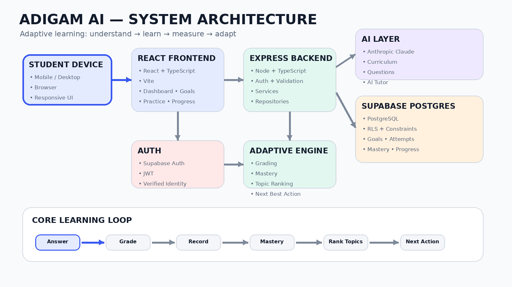
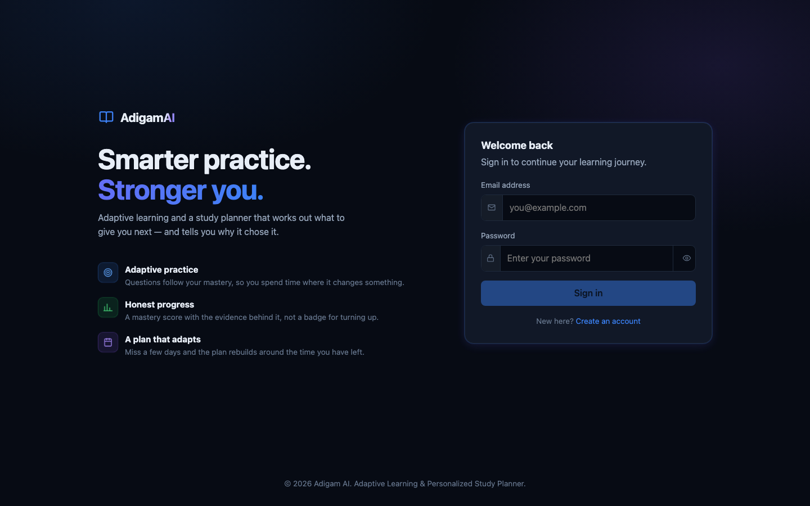

# Adigam AI

### ADAPT · LEARN · MASTER

**An adaptive learning assistant that turns a learner's own answers into a study plan it can explain.**

[](https://github.com/harsh-1-code/HackInMotion-RICR-HIM-1216/actions/workflows/ci.yml)

| | |
|---|---|
| **Live app** | https://adigamai.vercel.app |
| **Live API** | https://adigam-api.onrender.com/api/v1 |
| **Team code** | `RICR-HIM-1216` |
| **Theme** | Education & EdTech |

---

## Table of contents

1. [Project title](#1-project-title)
2. [Team](#2-team)
3. [Selected theme](#3-selected-theme)
4. [Problem statement](#4-problem-statement)
5. [Solution overview](#5-solution-overview)
6. [Key features](#6-key-features)
7. [Architecture](#7-architecture)
8. [Technology stack](#8-technology-stack)
9. [Project structure](#9-project-structure)
10. [Installation guide](#10-installation-guide)
11. [Environment variables](#11-environment-variables)
12. [API documentation](#12-api-documentation)
13. [Database details](#13-database-details)
14. [Security](#14-security)
15. [Testing](#15-testing)
16. [Screenshots](#16-screenshots)
17. [Deployment](#17-deployment)
18. [Implementation status](#18-implementation-status)
19. [Future scope](#19-future-scope)
20. [Demo video](#20-demo-video)
21. [Presentation](#21-presentation)
22. [License](#22-license)

---

# 1. Project title

## Adigam AI — AI-Powered Adaptive Learning Assistant & Personalized Study Planner

A learner tells Adigam what they are preparing for. It works out the syllabus, measures where they
actually stand, builds a day-by-day plan weighted toward their weak areas, and adjusts that plan when
they fall behind or when the studying is not working.

Every number it shows comes with the evidence behind it, and every instruction comes with the reason it
was chosen.

---

# 2. Team

**Team name:** RICR-HIM-1216
**HackInMotion team code:** `RICR-HIM-1216`

| Member | Role |
|---|---|
| Harsh Kumar | Team Lead + Database |
| Ayush Kumar | Backend |
| Soumya Raghuwanshi | Frontend + Presenter |
| Simran Kumari Keshri | Frontend |

---

# 3. Selected theme

## Education & EdTech

Adaptive learning, personalised study planning, and assessment-driven prioritisation for students
preparing for a dated exam.

---

# 4. Problem statement

Most learning platforms hand every student the same sequence of content, and they keep handing it over
regardless of what the student has demonstrated. They rarely account for:

- **What a learner already knows.** Time spent on a solved topic is time taken from an unsolved one.
- **What they are actually weak at**, as opposed to what they say they are weak at.
- **How much time is left.** A plan that ignores the exam date is a wish list.
- **Forgetting.** A topic learned in week one is gone by week eight unless something brings it back.
- **Why.** A recommendation a student cannot interrogate is one they stop following.

The result is a student who works hard, cannot tell whether it is working, and finds out at the exam.

---

# 5. Solution overview

Adigam closes a loop rather than serving a syllabus:

```text
answer  →  grade  →  record  →  recompute mastery  →  rank topics  →  next action
   ↑                                                                      │
   └──────────────────────────────────────────────────────────────────────┘
```

Every answer is evidence. Mastery is recomputed from the whole attempt log rather than nudged, so the
score always matches the history behind it. The plan, the revision schedule, the recommendation and the
readiness picture are all derived from that one source.

### What is deterministic, and why

The scoring and planning engines are pure functions with unit tests. **The planner does not call a
language model**, and that is a deliberate decision rather than a limitation: dividing a fixed number of
minutes between topics by how much each needs and how much each is worth is arithmetic. A plan produced
by a model could not be reproduced, could not be unit tested, and could not be explained to a learner
asking why Tuesday looks like that — and it would cost money and twenty seconds every time the plan
changed. Building a 179-day plan takes about four seconds, all of it database.

| Deterministic | Generative AI |
|---|---|
| Mastery scoring | Turning free text into a syllabus |
| Topic ranking and difficulty | Writing new practice questions |
| Study plan generation | Independently checking those answers |
| Adaptive re-planning | Answering a learner's doubt in context |
| Spaced repetition intervals | |
| Grading and mock-test marking | |
| Exam readiness scoring | |
| Streaks, badges, consistency | |

AI is used where judgement is genuinely required. Everything a learner is measured by is arithmetic they
could check by hand.

---

# 6. Key features

### Dynamic syllabus from free text
A learner types `class 10`, `12th boards` or `GATE CSE`. The model returns a structured syllabus, which
is then validated in four stages before anything is stored. Text that is not a study goal is refused
with a reason — `dog` comes back rejected rather than producing an empty app.

### Knowledge assessment
One question per topic, spread across every subject in the goal. Broad rather than deep on purpose: the
job is finding **where** a learner is weak, so covering twelve topics once beats covering three topics
four times. Results are reported as bands, not percentages, because three questions cannot support
"63%".

### Personalised study plan
Days remaining × minutes per day, divided by need. Need is how far a topic is from mastered × how much
of the exam it is worth. Sessions are laid out day by day, interleaved so a learner meets their whole
plan in the first week, and each one carries the sentence explaining why it is there.

### Adaptive re-planning
Runs when the plan is read, not from a button. Past sessions are settled from the answers actually
recorded, and the plan is rebuilt when three sessions are missed in a week or two topics stop improving.
Rate limited to once per twenty hours — a plan that changes every time you look at it is not adaptive.

### Spaced repetition
SM-2 intervals, the SuperMemo family Anki uses. A good review multiplies the gap; a bad one collapses it
to a day. Two adaptations: the unit is a topic rather than a flashcard, and **the exam caps the
interval** — scheduling a topic sixty days out when the exam is in thirty is not scheduling, it is
dropping the topic.

### Mock tests
A paper built from the topics the plan has scheduled, marked in one pass at the end. Nothing is revealed
mid-paper, and that is not client-side politeness — the server does not send the answers for an open
test, so the screen could not show them.

### Exam readiness
One number, and then immediately the arithmetic behind it: weighted mastery across the syllabus, share
of the paper attempted at all, recent mock form, and whether the days left are enough at the current
daily budget. Each part is shown with the weight it carried and a sentence naming what would move it.
Anything not yet measurable is **dropped and the rest reweighted, never scored as zero** — a learner
who has not sat a mock is not less ready than one who sat one and failed it, and a scheme that says
otherwise rewards avoiding the measurement.

Measured weakness is kept apart from what was never started, because those are different kinds of
claim: one is evidence, the other assumes a mastery of zero that was never checked.

### AI tutor, by voice or text
Grounded in the learner's mastery on the topic in view and the questions they recently got wrong. It is
never given the answer key. Voice input and spoken answers use the browser's own speech APIs, so they
add **nothing** to the bundle.

### Gamification
A year of activity as a grid, day streaks, consistency, and sixteen badges across five families. Badges
are derived from the record on every read rather than stored, which means a badge cannot be wrong.

### Study groups
Classmates preparing for the same thing, compared on effort. Shared: name, questions answered, streak,
topics mastered. **Not** shared: accuracy, weak topics, wrong answers, tutor conversations. Publishing
somebody's weak spots to their classmates would make the honest answer to "should I practise my weakest
topic" become "not while my friends can see".

### Explainable mastery
A 0–100 score from four weighted components — recent accuracy, historical accuracy, difficulty handled,
consistency — shrunk toward a neutral prior when the evidence is thin, and decayed when a topic goes
untouched. It is always shown next to the number of attempts behind it, because a score from three
answers means little and the interface should say so.

---

# 7. Architecture



### Request flow

```text
Browser (React)
    │  Supabase Auth — sign-in only, session in localStorage
    │  Bearer token on every request
    ▼
Express API  ─── authMiddleware: token verified with Supabase, identity taken from it
    │
    ├── controllers   HTTP shape, zod validation, no SQL
    ├── services      business rules, no SQL
    │     └── engines pure functions: mastery, adaptive, planning, SRS, badges, groups
    └── repositories  every query, no rules
              │
              ▼
        Supabase PostgreSQL — RLS on all 20 tables, column-level grants
```

### Layer rules, enforced by review

- **Controllers hold no SQL.** They validate, call a service, and shape a response.
- **Repositories hold no business rules.** They read and write.
- **Services hold no SQL.** They decide.
- **Engines are pure.** No I/O, no clock, no randomness — every one is unit tested against hand-worked
  examples.

### The AI boundary

Everything above the provider talks to an interface:

```ts
interface IAIProvider {
  generateJson(request: AIJsonRequest): Promise<AIJsonResponse>;
  generateText(request: AITextRequest): Promise<AITextResponse>;
}
```

`claudeProvider.ts` is the **only** file in the repository that imports the Anthropic SDK. Callers state
the quality they need — `'high'` for anything that becomes stored data, `'standard'` for text a person
reads and judges — and the provider maps that to a model. Swapping models, or substituting a fake one in
tests, is a change in one file.

### Four gates on generated questions

A wrong answer key is worse than no question: it marks a learner wrong for being right, and the mastery
engine then records that as evidence.

```text
1. schema-constrained generation
2. zod schema validation
3. business rules (length, option count, no filler)
4. independent answer check — a separate request that has never seen the proposed answer
```

A question becomes visible only when steps 1–4 all pass. Failures are kept but hidden, so what the model
got wrong can be reviewed rather than lost.

---

# 8. Technology stack

### Frontend

| | |
|---|---|
| React | 19 |
| TypeScript | 6 |
| Vite | 8 |
| Routing | react-router-dom 7 |
| Auth client | `@supabase/auth-js` |
| Styling | plain CSS with custom properties |
| Tests | Vitest |
| Lint | oxlint |

**No UI framework, no component library, no icon package, no charting library.** The shared bundle is
about **101 kB gzip**, and that is treated as a budget because this has to run on phones with 2–4 GB of
RAM. The activity heatmap is 365 `div`s in a CSS grid; the icons are inline SVG paths; the voice feature
uses the browser's own speech APIs and added zero bytes to the shared chunk.

`@supabase/auth-js` rather than the full `supabase-js` for the same reason: the app needs sign-in and a
session, and the full client additionally bundles PostgREST, realtime websockets, storage and edge
functions, which together roughly doubled the gzipped bundle for code that never runs.

### Backend

| | |
|---|---|
| Node | 22+ |
| Express | 5 |
| TypeScript | 5.9, run through `tsx` — no build step |
| Validation | zod 4 |
| AI | `@anthropic-ai/sdk` — Claude |
| Database client | `@supabase/supabase-js` |
| Tests | Vitest |

### Data & AI

| | |
|---|---|
| Database | Supabase PostgreSQL 17 (Mumbai) |
| Auth | Supabase Auth, JWT verified server-side |
| Models | `claude-opus-5` for stored data, `claude-sonnet-5` for the tutor |

---

# 9. Project structure

```text
HackInMotion-RICR-HIM-1216/
├── backend/
│   └── src/
│       ├── config/            env parsing, database clients
│       ├── controllers/       HTTP shape and validation
│       ├── middleware/        auth, rate limiting, body validation
│       ├── repositories/      every SQL query
│       ├── routes/            route tables
│       ├── services/
│       │   ├── adaptive/      recommendation, difficulty, question selection
│       │   ├── ai/            IAIProvider, prompts, response validation
│       │   ├── assessment/    diagnostic and mock-test engines
│       │   ├── groups/        ranking and invite codes
│       │   ├── learner/       mastery, habits, spaced repetition, badges, activity
│       │   ├── learning/      curriculum resolution, goals
│       │   ├── planning/      plan generation and re-planning
│       │   ├── practice/      grading
│       │   └── questions/     AI question generation pipeline
│       ├── utils/             errors, dates, HTTP helpers
│       └── server.ts
│   └── tests/unit/            328 tests
│
├── frontend/
│   └── src/
│       ├── components/        Activity, Icon, Loading, layout
│       ├── features/auth/     AuthProvider
│       ├── hooks/             useApi, useTheme, useVoice
│       ├── lib/               api client, supabase auth client
│       ├── pages/             11 screens, each its own lazy chunk
│       └── router.tsx
│   └── tests/                 7 tests
│
├── database/
│   ├── migrations/            schema, in order
│   ├── seed/                  seed topics and questions
│   └── tests/                 58 checks, run in rolled-back transactions
│
├── docs/
│   ├── architecture.md        technical walkthrough
│   ├── security.md            what a browser can and cannot reach, with proofs
│   ├── challenges.md          the five problem-statement challenges
│   └── deployment.md          both hosts, and the free-tier limits
│
└── .github/workflows/         CI, and a keep-alive for the free tier
```

---

# 10. Installation guide

### Prerequisites

- Node.js 22 or newer
- A Supabase project (free tier is enough)
- An Anthropic API key — optional; everything except AI features works without one
- `psql`, for applying migrations

### 1. Clone

```bash
git clone https://github.com/harsh-1-code/HackInMotion-RICR-HIM-1216.git
cd HackInMotion-RICR-HIM-1216
```

### 2. Install

```bash
cd backend  && npm install
cd ../frontend && npm install
```

### 3. Configure

```bash
cp backend/.env.example  backend/.env
cp frontend/.env.example frontend/.env
```

Fill both in — see [Environment variables](#11-environment-variables). If a Postgres password contains
`@` or `#`, percent-encode it (`%40`, `%23`) or the connection URL will not parse.

### 4. Apply migrations, in order

```bash
cd backend
DB=$(grep '^DATABASE_URL' .env | cut -d= -f2- | tr -d '"')

for f in ../database/migrations/*.sql; do
  psql "$DB" -v ON_ERROR_STOP=1 -f "$f"
done
```

`000_roles.sql` must run first. It grants the service role what it needs — without it the backend cannot
read its own question bank.

### 5. Seed (optional)

```bash
psql "$DB" -f ../database/seed/demo_questions.sql
```

That one file carries both the default syllabus tree and the starter question bank. Every insert ends
in `ON CONFLICT DO NOTHING` against fixed ids, so running it twice changes nothing.

### 6. Run

```bash
cd backend  && npm run dev     # http://localhost:4000/api/v1
cd frontend && npm run dev     # http://localhost:5173
```

Check it: `curl http://localhost:4000/api/v1/health/deep` should report the database as reachable.

---

# 11. Environment variables

### Backend — `backend/.env`

| Variable | Required | Notes |
|---|---|---|
| `NODE_ENV` | no | `development` by default |
| `PORT` | no | `4000` by default |
| `CORS_ORIGINS` | yes | comma-separated. Include `http://localhost:4173` if you use `vite preview` — a request from an unlisted origin fails in the browser as a generic network error, not as a CORS one, which sends you looking in the wrong place |
| `SUPABASE_URL` | yes | project URL |
| `SUPABASE_PUBLISHABLE_KEY` | yes | safe to expose |
| `SUPABASE_SECRET_KEY` | yes | **server only** — never in a browser |
| `ANTHROPIC_API_KEY` | no | omit and AI features return a clear 503; everything else works |
| `DATABASE_URL` | for `psql` only | session pooler string, used to apply migrations and run the SQL tests. The server never reads it — it is not in the env schema — so production does not need it |

An empty value is treated as absent rather than as an empty string. That is deliberate: a stray
`ANTHROPIC_API_KEY=` once made the server refuse to boot with no useful message.

### Frontend — `frontend/.env`

| Variable | Required | Notes |
|---|---|---|
| `VITE_API_URL` | yes | e.g. `http://localhost:4000/api/v1` |
| `VITE_SUPABASE_URL` | yes | project URL |
| `VITE_SUPABASE_PUBLISHABLE_KEY` | yes | compiled into the bundle and meant to be public — it grants nothing without a signed-in learner's token |

**The build fails if any of these are missing, on purpose.** Vite inlines a missing variable as
`undefined`, which turns the guard in `lib/supabase.ts` into an unconditional throw and lets Rollup
tree-shake the auth client away — producing a build that succeeds, weighs 25 kB less, and white-screens
on load. Measured on this project: 98 kB with the variables, 73 kB without, both reported as clean
builds. `vite.config.ts` now refuses and names what is missing.

---

# 12. API documentation

Base URL: `/api/v1`. Every route except the health checks requires `Authorization: Bearer <token>`.
Identity is taken from the verified token — **no endpoint accepts a user id**.

Every response has the same envelope:

```json
{ "success": true,  "data": { }, "error": null }
{ "success": false, "data": null, "error": { "code": "INVALID_INPUT", "message": "..." } }
```

### Endpoints

| Method | Path | Purpose |
|---|---|---|
| `GET` | `/health` | process up |
| `GET` | `/health/deep` | process up **and** database reachable |
| `GET` | `/learner/summary` | attempts, accuracy, habits, weakest topics |
| `GET` | `/learner/activity` | a year of activity, streaks, badges, next milestones |
| `GET` | `/learner/subjects` | the goal's subjects with per-subject progress |
| `GET` | `/learner/profile` | name, email, timezone |
| `PATCH` | `/learner/profile` | display name and timezone only |
| `GET` | `/goals` | active goal, or `null` |
| `POST` | `/goals` | set a goal; archives the previous one |
| `GET` | `/goals/subjects?curriculumId=` | subjects in a syllabus |
| `GET` | `/curricula/default` | the syllabus shipped with the app |
| `POST` | `/curricula/resolve` | free text → syllabus, or a reasoned rejection |
| `GET` | `/recommendations/next` | **what to do now, and why** |
| `POST` | `/attempts` | grade an answer, update mastery, habits and revision |
| `POST` | `/questions/generate` | grow the bank for a topic |
| `GET` | `/assessments/diagnostic` | the knowledge check for this goal, or `null` |
| `POST` | `/assessments/diagnostic` | build and start one |
| `GET` | `/assessments/:id` | questions while open, result once submitted |
| `POST` | `/assessments/:id/submit` | mark it, and move mastery |
| `GET` | `/study-plan/current` | the plan; also settles past sessions and may re-plan |
| `POST` | `/study-plan/generate` | build a new version |
| `GET` | `/revision/due` | topics the schedule says are due |
| `GET` | `/readiness` | **how ready you are, and the arithmetic behind it** |
| `GET` | `/mock-tests` | recent papers, plus any left open |
| `POST` | `/mock-tests` | build one from the plan |
| `GET` | `/mock-tests/:id` | questions while open, result once submitted |
| `POST` | `/mock-tests/:id/submit` | mark the whole paper in one pass |
| `GET` | `/ai/conversations` | tutor history |
| `GET` | `/ai/conversations/:id` | one thread |
| `POST` | `/ai/tutor` | ask a doubt, grounded in learner state |
| `GET` | `/groups` | groups this learner is in |
| `POST` | `/groups` | create one, with an invite code |
| `POST` | `/groups/join` | join by code |
| `GET` | `/groups/:id` | members and the ranked comparison |
| `POST` | `/groups/:id/leave` | leave |

### Rate limits

Per learner, per hour. The reason differs by endpoint.

| Endpoint | Limit | Why |
|---|---|---|
| `POST /questions/generate` | 10 | each call is real money at the model |
| `POST /curricula/resolve` | 20 | free-text AI entry point |
| `POST /ai/tutor` | 40 | AI cost, but a learner asks a lot in a session |
| `POST /study-plan/generate` | 20 | writes ~100 rows and supersedes the previous plan |
| `POST /mock-tests` | 20 | writes a paper and retires the open one |
| `POST /groups/join` | 30 | **not a cost limit** — six characters from a 31-symbol alphabet is ~900 million codes, and unlimited attempts turn that into a guessing game whose prize is standing inside a stranger's group |

### Example — set a goal

```http
POST /api/v1/goals
Authorization: Bearer <token>

{
  "title": "GATE CSE",
  "curriculumId": "03bd263b-db30-4ca6-8863-ea129038a9db",
  "examDate": "2027-02-09",
  "dailyMinutes": 60,
  "subjectIds": ["d40d72d1-...", "9901df76-..."]
}
```

```json
{
  "success": true,
  "data": { "goal": {
    "id": "96259544-...", "title": "GATE CSE",
    "examDate": "2027-02-09", "dailyMinutes": 60,
    "daysRemaining": 179, "totalMinutesAvailable": 10740
  }},
  "error": null
}
```

### Example — what should I do now

```http
GET /api/v1/recommendations/next
```

```json
{
  "success": true,
  "data": {
    "recommendation": {
      "action": "practice",
      "topic": { "id": "b0000000-...", "name": "Normalisation" },
      "difficulty": "easy",
      "questionCount": 2,
      "estimatedMinutes": 3,
      "reason": "Normalisation is at mastery 16 but your recent accuracy is only 10%, so 2 questions at easy level will rebuild the basics.",
      "signals": {
        "masteryScore": 16.38, "recentAccuracyPercent": 10,
        "totalAttempts": 17, "daysSinceLastAttempt": 0
      }
    },
    "questions": [ { "id": "...", "body": "...", "options": ["..."], "difficulty": "easy" } ]
  },
  "error": null
}
```

Note what the questions do **not** contain: `correct_answer` and `explanation`. They arrive only in the
response to a submitted attempt.

### Example — submit an answer

```http
POST /api/v1/attempts

{ "questionId": "ec1bbfb0-...", "selectedOptions": [0], "timeTakenSeconds": 25 }
```

```json
{
  "success": true,
  "data": {
    "attemptId": "07d20d07-...",
    "isCorrect": false,
    "correctAnswer": [1],
    "explanation": "Array indexing starts at 0, so arr[4] is offset by 4 elements...",
    "mastery": { "before": null, "after": 29.17, "change": null, "attemptsOnTopic": 1 }
  },
  "error": null
}
```

Full write-up: [`docs/architecture.md`](docs/architecture.md).

---

# 13. Database details

**Supabase PostgreSQL 17 (Mumbai).** 20 tables, row-level security on all 20, 21 policies. Currently
holding 5 curricula, 302 topics and 165 verified questions.

### Tables

| Group | Tables |
|---|---|
| Identity | `profiles`, `learner_profiles` |
| Content | `curricula`, `topics`, `questions` |
| Goals | `learning_goals`, `learning_goal_topics` |
| Evidence | `question_attempts`, `concept_mastery` |
| Assessment | `assessments`, `assessment_questions` |
| Planning | `study_plans`, `study_sessions`, `revision_schedule` |
| Mock tests | `mock_tests`, `mock_test_questions` |
| Tutor | `ai_conversations`, `ai_messages` |
| Groups | `study_groups`, `group_members` |

### Topic hierarchy

Topics are self-referencing. A curriculum holds subjects; a subject holds the topics that are actually
practised.

```text
curriculum  →  subject (parent_id null)  →  topic (leaf)
GATE CSE    →  Databases                 →  Normalisation
                                         →  Transactions
```

A goal selects **subjects**; the engines rank the leaves inside them.

### From evidence to recommendation

```text
question_attempts   append-only, one row per answer, timestamped
        ↓  masteryEngine
concept_mastery     score + the evidence it came from, rebuildable
        ↓  recommendationEngine
next action         topic + difficulty + count + a sentence
```

`concept_mastery` and `learner_profiles` are **caches over the attempt log**. If a formula changes, the
version is bumped and they are recomputed — the attempts are the truth.

### Principles

- **Identity is never a column the caller supplies.** Triggers overwrite `topic_id` and `attempt_number`
  on attempts, `user_id` on plan sessions, and `topic_id` on mock-test questions, precisely because a
  denormalised field the caller controls is one the caller can lie about.
- **Constraints encode the rules twice.** Difficulty buckets must sum to total attempts; a current
  streak may not exceed the longest; lapses may not exceed reviews; a submitted test must carry a
  complete result. The application maintains these too — the copy in the database is the one that
  cannot be forgotten during a refactor.
- **Generated columns rather than computed writes.** `accuracy` is `generated always as`, so it can
  never disagree with the two counts it comes from.
- **One active row where one is meant to exist.** A partial unique index enforces one active plan per
  learner, in the database, because every screen asks for "the" current plan.

---

# 14. Security

Full write-up with the commands to verify each claim: [`docs/security.md`](docs/security.md).

Three risks, and they need different mechanisms:

| Risk | Why it matters | Defence |
|---|---|---|
| Reading another learner's data | ordinary privacy | row-level security, all 20 tables |
| Reading data about *yourself* that breaks the product | an answer key makes every score meaningless | **column-level** privileges |
| Writing data about yourself | self-set mastery makes every plan and recommendation fiction | **no write privilege at all** |

The third is the one most easily overlooked. A learner who could set their own mastery is not a privacy
problem — they are a correctness problem, because the plan, the revision schedule and every readiness
figure derive from it.

### The answer key is unreachable from the browser

`questions` grants `authenticated` SELECT on seven named columns. `correct_answer` and `explanation` are
not among them. This is not a filtered API response — asked directly, with a valid signed-in token:

```text
GET /rest/v1/questions?select=correct_answer   →  42501 permission denied
GET /rest/v1/questions?select=*                →  42501 permission denied
GET /rest/v1/questions?select=body             →  200  [{"body":"In C, what is 17 % 5?"}]
```

The middle line is the important one. `select=*` **fails** rather than quietly returning the allowed
columns, so there is no shape of that request which leaks the key.

### Learners hold no write privilege

Across all 20 tables, `authenticated` has **zero** table-level INSERT, UPDATE or DELETE grants. The only
write privilege anywhere in the schema is column-level UPDATE on four columns of `profiles` —
`display_name`, `avatar_url`, `timezone`, `settings`. Tested from the browser against the learner's own
row:

```text
PATCH profiles        {"email": "hacked@evil.com"}   →  42501 permission denied
PATCH concept_mastery {"mastery_score": 100}         →  42501 permission denied
PATCH profiles        {"display_name": "Ayush"}      →  200  updated
```

### Also

- **404, not 403**, for anything that is not yours — telling somebody a record exists but is not theirs
  confirms the id. A malformed id returns the same 404, so the two cannot be told apart by probing.
- **zod at both trust boundaries**: HTTP bodies *and* model output. A language model is an untrusted
  input source.
- **Secrets** — the service key, the Anthropic key and the connection string live only in the backend
  environment. `.env` has been gitignored since the first commit, and the whole git history was scanned
  for keys before the repository was made public.
- **Honest limitations** are listed in `docs/security.md`: in-process rate limiting that resets on
  deploy, question verification by a second model call rather than a human, invite codes that cannot be
  rotated, no audit log, and a free-tier deployment with no WAF.

---

# 15. Testing

```bash
cd backend  && npm test     # 328 tests, 19 files
cd frontend && npm test     #   7 tests
cd backend  && npm run typecheck
```

CI runs typecheck, lint, both suites and a full production build on every push and pull request.

### What the tests are for

They are not coverage theatre. The engines encode judgements, and each suite pins the promises that
engine must not break. Several exist because they caught a real bug:

- **Difficulty weighting did nothing.** 20 easy-correct and 20 hard-correct both scored 87. Caught by a
  unit test before it shipped.
- **The plan gave a topic measured as weak *less* time than one never measured**, because unknown
  mastery was standing in for zero. Answering a diagnostic question wrong moved that topic from 105
  planned minutes to 75. Two tests now pin the ordering.
- **A generation race charged three times for one topic.** Three simultaneous requests each found
  nothing and each generated. The test asserts the number of **AI calls**, not questions, because
  duplicate generation is invisible in the response and shows up only on the bill.
- **A clock-skew error was a 500 on the first screen after signing in.** Intermittent by nature, so it
  is only demonstrable by test — seven of them.

### Database tests

```bash
psql "$DATABASE_URL" -v ON_ERROR_STOP=1 -f database/tests/003_questions.test.sql
```

58 numbered checks across 8 files, each inside a transaction that rolls back, so they are safe to run
repeatedly against a live database. They assert the properties above — including that a learner cannot
read `correct_answer`.

---

# 16. Screenshots

### Sign in



### Dashboard


### AI Tutor


### Goal setup


### Knowledge check


### Landing page


### Login page


### Practice


### Study plan


### Study group


### Progress


### Voice module


### The rest

The live app is the better tour, and the link is at the top. Behind sign-in there are ten screens:

| Screen | What it shows |
|---|---|
| Dashboard | the next action with the reason it was chosen, a year of activity, the badge shelf |
| Your goal | free-text goal entry, the resolved syllabus, subject selection, exam date |
| Knowledge check | the diagnostic that tells the plan where to start |
| Study plan | today first, the rest collapsed, every session explained |
| Practice | subject picker, then one question at a time with the mastery change after each |
| Mock tests | a paper marked at the end, broken down by topic, weakest first |
| Exam readiness | the score, every component that made it, and the topics costing the most |
| Ask Adigam | the tutor, by typing or by voice, grounded in your own mastery |
| Groups | a leaderboard, and a plain statement of what it does and does not reveal |
| Settings | name, timezone, and dark / light / match-device |

---

# 17. Deployment

Both halves are live, and both are on free tiers.

| Part | Host | URL |
|---|---|---|
| Frontend | Vercel | https://adigamai.vercel.app |
| Backend API | Render (Singapore) | https://adigam-api.onrender.com/api/v1 |
| Database | Supabase | PostgreSQL 17, Mumbai |

### Keeping a free tier awake

Two deadlines, neither of them a billing problem: the backend spins down after about fifteen minutes
idle, and the database pauses after about a week of inactivity. A paused database is not a slow app — it
is a dead one.

A scheduled job pings `GET /api/v1/health/deep` every ten minutes. The deep check is the point: the
shallow one touches only Express, so pinging it would keep the instance warm and quietly let the
database pause anyway. One counted read satisfies both.

Details, and the free-plan instance-hour limit that makes this a judgement call:
[`docs/deployment.md`](docs/deployment.md).

---

# 18. Implementation status

### Built and running

| | |
|---|---|
| Database | 20 tables, RLS on all 20, 21 policies, 58 SQL checks |
| Auth | Supabase Auth, JWT verified server-side, sign-up and sign-in |
| Content | dynamic AI-resolved syllabi, 165 verified questions, on-demand generation |
| Evidence | append-only attempts, server-side grading, mastery engine |
| Adaptive | topic ranking, difficulty ladder, question selection with fallbacks |
| Assessment | diagnostic knowledge check feeding the planner |
| Planning | versioned day-by-day plans, automatic re-planning |
| Retention | SM-2 spaced repetition, exam-capped intervals |
| Mock tests | plan-derived papers, marked in one pass |
| Readiness | one score, every component that made it, published thresholds |
| Tutor | context-grounded, voice in and out |
| Gamification | activity heatmap, streaks, consistency, 16 badges |
| Groups | invite-code only, deliberate privacy boundary |
| Frontend | 11 screens, code-split per route, ~101 kB gzip shared, dark and light themes |
| Ops | CI on every push, keep-alive, deep health check |

### Not built

- Mistake and misconception engine — recurring conceptual errors, and targeted interventions
- What-if simulation — "what happens if I study 30 extra minutes a day"
- AI insights screen — narrative progress summaries
- Multilingual tutoring
- Teacher and mentor dashboards

---

# 19. Future scope

Everything below is genuinely not built. Features that once sat on this list — the study planner,
adaptive re-planning, spaced repetition, mock tests, the AI tutor, voice interaction and the exam
readiness score — have since shipped and moved to the section above.

### Mistake and misconception engine
Cluster wrong answers by the misconception behind them rather than by topic, and intervene on the
misconception. Two learners can fail the same question for different reasons and need different help.

### What-if simulation
Re-run the planner against a changed budget and show the projected difference. The planner is already a
pure function, so this is a second call rather than new machinery.

### Multilingual learning
Hindi and Indian regional languages for tutoring, explanations and plans. The tutor already prompts in
English only; voice recognition is already tuned to `en-IN` rather than `en-US`, because US recognition
mishears Indian-accented English often enough to make voice input worse than typing.

### Beyond
Teacher and mentor dashboards · institutional deployments · offline-first practice · advanced knowledge
tracing (DKT/BKT) rather than a weighted formula · multi-exam parallel preparation.

---

# 20. Demo video

**[Watch the demo](https://drive.google.com/file/d/1OZOz8_7u6kZ3lz69ClFEG-mfdVaGTqsQ/view?usp=sharing)**

What it covers:

```text
Sign up  →  Goal in plain words ("GATE CSE")  →  AI resolves the syllabus
         →  Knowledge check  →  Plan built around the weak subjects
         →  Practice, with mastery moving  →  Ask by voice
         →  Mock test  →  Group comparison
```

---

# 21. Presentation

**[Download the slide deck](https://github.com/user-attachments/files/31072621/4bdf50dc-2c4f-436e-a971-9a77172d16af.pptx)**

Story arc:

| # | Section |
|---|---|
| 1 | The problem — same content for every student, no feedback loop |
| 2 | A student's story — works hard, cannot tell if it is working |
| 3 | The solution — evidence in, explainable next action out |
| 4 | The student journey — goal → assessment → plan → practice → adapt |
| 5 | The adaptive loop — answer, grade, mastery, rank, next |
| 6 | AI strategy — where a model is used, and where arithmetic is used instead |
| 7 | Features |
| 8 | Architecture |
| 9 | Security — the answer key, and read-only mastery |
| 10 | Impact |
| 11 | Future scope |
| 12 | Live demo |

---

# 22. License

**Proprietary — all rights reserved.** See [LICENSE](LICENSE).

The source may be read for the purpose of hackathon evaluation. It may not be copied, modified,
redistributed or reused without written permission.

---

<div align="center">

**Adigam AI** · ADAPT · LEARN · MASTER

Built for **HackInMotion 2026** · Education & EdTech · Team `RICR-HIM-1216`

</div>
