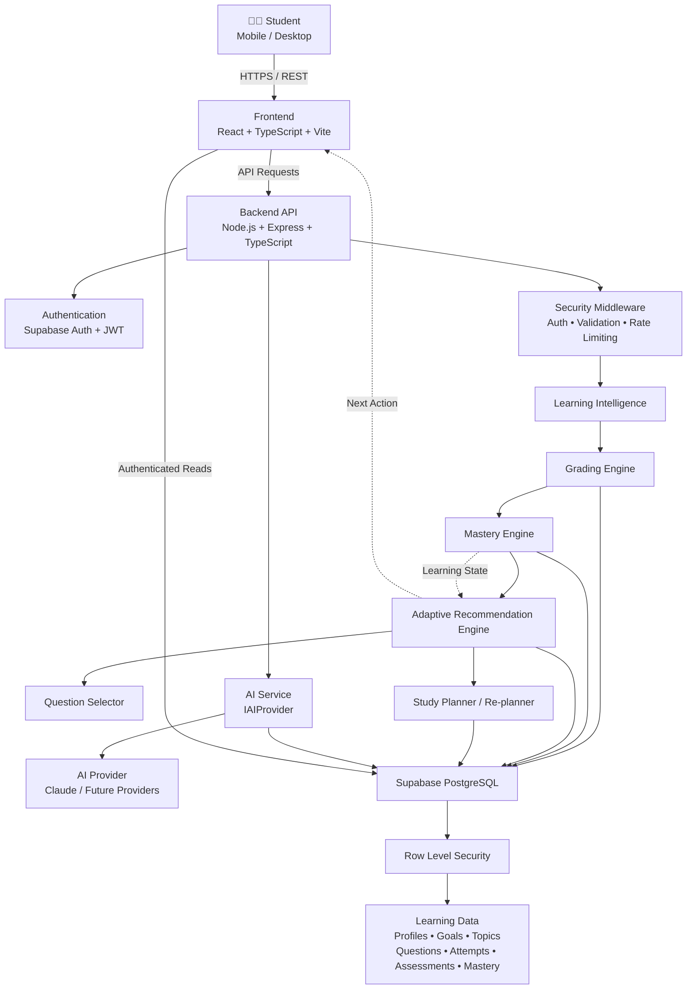
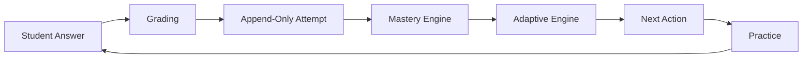
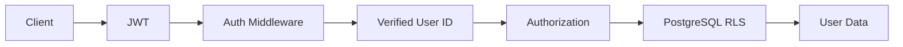
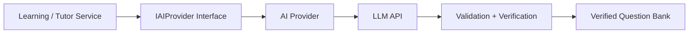

# AdhigamAI — Adapt. Learn. Master.

> **An adaptive AI-powered learning platform that continuously transforms learner performance into personalized, explainable next actions.**

## 👥 Team

| Name | Role |

| Team Name | **[AdhigamAI]** 
| Team Member 1 | **[Harsh Kumar]** | Database |
| Team Member 2 | **[Ayush Kumar]** | Backend |
| Team Member 3 | **[Soumya Raghuwanshi]** | Frontend |
| Team Member 4 | **[Simran Kumari Keshri]** | Frontend |


# ❗ Problem Statement

Traditional learning systems generally provide the same sequence of content and practice to every learner. They often fail to continuously account for:

- What a learner already knows
- Which concepts are weak
- Recent performance
- Difficulty handling
- Consistency over time
- Available study time
- Missed study sessions
- Changing learning priorities

As a result, learners may spend too much time on concepts they already understand while important weak areas remain unattended.

The challenge is to build a learning system that can **assess the learner, understand their current learning state, recommend the next best action, and adapt that recommendation as new evidence becomes available**, while remaining secure, modular, scalable and usable on low-end devices.

---

# 💡 Solution Overview

## adhigamAI — Adapt. Learn. Master.

adhigamAI is an adaptive learning platform built around a continuous learning loop:

```text
Student Answer
      ↓
     Grade
      ↓
Store Evidence
      ↓
Calculate Mastery
      ↓
Identify Learning Priority
      ↓
Recommend Next Action
      ↓
Student Practices
      ↓
New Evidence
      ↓
     Adapt
      ↺
```

Instead of using an LLM to make every learning decision, adhigamAI separates **deterministic learning intelligence** from **generative AI**.

### Deterministic engines handle:

- Grading
- Mastery calculation
- Topic prioritization
- Difficulty selection
- Question selection
- Adaptive recommendations

### AI handles:

- Question generation
- Explanations
- Personalized tutoring
- Natural-language learning assistance

This makes the learning system more **explainable, reproducible, testable and reliable**.

---

# ✨ Key Features

### 🧠 Adaptive Learning

The system continuously updates the learner's learning state based on actual performance.

### 📊 Evidence-Based Mastery

Mastery is derived from multiple evidence signals rather than a single test score.

Current mastery factors include:

| Signal | Weight |
|---|---:|
| Recent accuracy | 40% |
| Historical accuracy | 25% |
| Difficulty handling | 25% |
| Consistency | 10% |

Evidence shrinkage and recency decay prevent insufficient or stale evidence from being treated as strong mastery.

### 🎯 Explainable Recommendations

The system identifies high-priority topics using:

```text
Priority =
(0.7 × Knowledge Gap + 0.3 × Staleness)
× Topic Importance
```

The learner receives an actionable recommendation rather than just analytics.

### 🔄 Adaptive Difficulty

Difficulty adapts according to the learner's mastery and recent performance.

```text
Mastery < 40      → Easy
40–69             → Medium
70+               → Hard
```

Recent performance can further adjust difficulty when sufficient evidence exists.

### 🧩 Finish-What-You-Started Logic

If a learner has already started a topic and its mastery remains below the defined threshold, the system prioritizes completing that learning path instead of continuously opening new topics.

### 🤖 AI-Assisted Learning

AI can generate questions and explanations through an abstract provider interface.

AI-generated questions pass validation and independent answer verification before becoming available to learners.

### 🔐 Security by Design

The architecture includes:

- JWT-based authentication
- Server-derived user identity
- Authorization checks
- PostgreSQL Row Level Security
- Database constraints and triggers
- Protected question answer keys
- Server-side grading
- Rate limiting and validation

### 📱 Low-End Device Friendly

The frontend is intentionally lightweight. Computationally heavier learning operations are performed on the backend, reducing the amount of work required from the learner's device.

### 🧱 Modular and Scalable

The system separates:

```text
Routes
  ↓
Controllers
  ↓
Services
  ↓
Learning Engines / Repositories
  ↓
Database
```

AI providers are abstracted behind an interface so the provider can be replaced independently.

---

# 🏗️ Architecture

## System Architecture



## Core Adaptive Learning Loop



## Security Architecture



## AI Architecture



### Architecture Principles

- **Thin Client:** Keep the frontend lightweight for low-end devices.
- **Backend-Driven Intelligence:** Learning computation happens primarily on the server.
- **Deterministic Core:** Mastery and adaptive decisions are not delegated to an LLM.
- **AI Abstraction:** AI providers are isolated behind an interface.
- **Security by Design:** Authentication, authorization and database-level isolation are part of the architecture.
- **Modularity:** Business logic is separated into services, engines and repositories.
- **Scalability:** The initial system is a modular backend that can later be decomposed into independent services if required.

---

# 🛠️ Technology Stack

## Frontend

- React
- TypeScript
- Vite
- Responsive UI

## Backend

- Node.js
- Express
- TypeScript
- REST APIs
- Zod validation

## Database & Authentication

- Supabase
- PostgreSQL
- Supabase Auth
- PostgreSQL Row Level Security (RLS)

## AI

- AI Provider Abstraction (`IAIProvider`)
- Anthropic Claude / compatible future providers

## Testing

- Backend unit tests
- Database/security assertions
- API/integration testing

## Engineering Practices

- Modular architecture
- Object-oriented design
- Service / repository separation
- Environment-based configuration
- Input validation
- Secure secret management
- Error handling and logging

---

# 📂 Project Structure

```text
adhigamAI/
│
├── frontend/
│   ├── src/
│   ├── components/
│   ├── pages/
│   └── services/
│
├── backend/
│   ├── src/
│   │   ├── routes/
│   │   ├── controllers/
│   │   ├── services/
│   │   ├── engines/
│   │   ├── repositories/
│   │   ├── middleware/
│   │   ├── ai/
│   │   └── utils/
│   │
│   └── tests/
│
├── supabase/
│   └── migrations/
│
├── docs/
│   ├── architecture/
│   ├── screenshots/
│   └── api/
│
├── .env.example
├── README.md
└── package.json
```

---

# ⚙️ Installation Guide

## Prerequisites

Install:

- Node.js 20+ recommended
- npm
- Git
- A Supabase project
- An AI provider API key if AI features are enabled

## 1. Clone the repository

```bash
git clone <YOUR_REPOSITORY_URL>
cd adhigamAI
```

## 2. Install frontend dependencies

```bash
cd frontend
npm install
```

## 3. Install backend dependencies

```bash
cd ../backend
npm install
```

## 4. Configure environment variables

Create `.env` files from the provided `.env.example`.

```bash
cp .env.example .env
```

Configure the required Supabase and AI credentials.

## 5. Apply database migrations

Run the Supabase migrations using the project's configured Supabase workflow.

## 6. Start the backend

```bash
cd backend
npm run dev
```

## 7. Start the frontend

In another terminal:

```bash
cd frontend
npm run dev
```

The local frontend and backend URLs will be displayed in the terminal.

---

# 🔐 Environment Variables

Never commit real secrets to Git.

Create environment variables using `.env.example`.

## Backend

```env
PORT=5000
NODE_ENV=development

SUPABASE_URL=your_supabase_project_url
SUPABASE_ANON_KEY=your_supabase_anon_key
SUPABASE_SERVICE_ROLE_KEY=your_supabase_service_role_key

AI_PROVIDER=claude
ANTHROPIC_API_KEY=your_anthropic_api_key

FRONTEND_URL=http://localhost:5173
```

## Frontend

```env
VITE_API_BASE_URL=http://localhost:5000/api
VITE_SUPABASE_URL=your_supabase_project_url
VITE_SUPABASE_ANON_KEY=your_supabase_anon_key
```

> **Security:** `SUPABASE_SERVICE_ROLE_KEY` and `ANTHROPIC_API_KEY` must remain server-side and must never be exposed through frontend environment variables.

> Adjust variable names to match the final implementation before submission.

---

# 🔌 API Documentation

The backend exposes REST APIs for authentication, goals, assessments, attempts, learner state and adaptive recommendations.

## Health

```http
GET /api/health
```

Example:

```json
{
  "status": "ok",
  "service": "adhigamAI"
}
```

## Goals

### Create Goal

```http
POST /api/goals
Authorization: Bearer <JWT>
Content-Type: application/json
```

Example:

```json
{
  "title": "GATE CSE Preparation",
  "deadline": "2027-02-01",
  "daily_minutes": 120
}
```

### Get Current Goal

```http
GET /api/goals/current
Authorization: Bearer <JWT>
```

## Assessment

### Create Assessment

```http
POST /api/assessments
Authorization: Bearer <JWT>
```

### Submit Assessment

```http
POST /api/assessments/:id/submit
Authorization: Bearer <JWT>
Content-Type: application/json
```

## Attempts

### Submit Answer

```http
POST /api/attempts
Authorization: Bearer <JWT>
Content-Type: application/json
```

Example:

```json
{
  "question_id": "question-id",
  "answer": "B",
  "time_taken_ms": 42000
}
```

The backend performs grading and stores the attempt as learning evidence.

## Learner State

```http
GET /api/learner/profile
Authorization: Bearer <JWT>
```

## Recommendation

```http
GET /api/recommendations/next
Authorization: Bearer <JWT>
```

Example response:

```json
{
  "topic": "Normalization",
  "action": "practice",
  "difficulty": "easy",
  "estimated_minutes": 20,
  "reason": "High learning gap and priority for the current goal."
}
```

> **Note:** Update endpoint paths and request/response schemas to exactly match the final implementation before submission. The README should always reflect the deployed API contract.

---

# 🗄️ Database Details

adhigamAI uses **Supabase PostgreSQL** as the persistent relational data layer.

## Core entities

```text
profiles
   │
   ├── learner_profiles
   │
   └── learning_goals
          │
          └── goal_topics
                 │
                 └── topics
                        │
                        └── questions
                               │
                               └── question_attempts
                                      │
                                      └── concept_mastery

assessments
```

The learning system stores evidence rather than only final scores.

### Important database principles

#### Append-only evidence

Question attempts are treated as learning evidence and are not overwritten during normal learning flow.

#### Row Level Security

Users can access only the records permitted by their authenticated identity.

#### Protected answer keys

Question answer keys are protected from ordinary client access. Grading happens on the backend.

#### Database constraints

Foreign keys, unique constraints, checks and triggers protect data integrity.

---

# 🧠 Learning Intelligence

The intelligence layer is composed of independent engines.

```text
                    Learning Intelligence
                            │
          ┌─────────────────┼─────────────────┐
          ▼                 ▼                 ▼
      Grading           Mastery          Adaptive
       Engine            Engine           Engine
          │                 │                 │
          └─────────────────┼─────────────────┘
                            ▼
                     Next Best Action
```

### Mastery Engine

Uses:

- Recent accuracy
- Historical accuracy
- Difficulty handling
- Consistency
- Evidence shrinkage
- Recency effects

### Adaptive Engine

Uses:

- Mastery gap
- Topic staleness
- Topic importance
- Current learning state
- Recent performance
- Available time

### Question Selection

Prioritizes:

1. Unseen questions at target difficulty
2. Unseen questions at other difficulties
3. Previously seen questions when necessary

---

# 🔐 Security

Security is implemented across multiple layers:

```text
JWT Authentication
       ↓
Verified Identity
       ↓
Authorization
       ↓
RLS
       ↓
Database Constraints
       ↓
Protected Answer Keys
       ↓
Server-side Grading
```

Additional protections include:

- Input validation
- Rate limiting
- Secure environment variables
- Error handling
- Server-side AI API calls
- No client-controlled ownership
- Database-level isolation

---

# 🖥️ Screenshots

Add final product screenshots here before submission.

### Landing Page

```text
docs/screenshots/landing.png
```


### Student Dashboard

```text
docs/screenshots/dashboard.png
```


### Adaptive Recommendation

```text
docs/screenshots/recommendation.png
```


### Assessment

```text
docs/screenshots/assessment.png
```


### AI Tutor

```text
docs/screenshots/ai-tutor.png
```


> Replace these paths with the actual screenshots committed to the repository.

---

# 🚀 Deployment

### Frontend

**Deployment URL:** `[ADD DEPLOYMENT LINK]`

### Backend API

**API URL:** `[ADD API DEPLOYMENT LINK]`

### Database

Supabase PostgreSQL.

> If deployment is not available yet, write `Coming Soon` rather than adding a placeholder URL.

---

# 🔮 Future Scope

adhigamAI is designed to evolve beyond the initial MVP.

## Planned improvements

### 📅 Intelligent Study Planner

Generate complete schedules based on:

- Goals
- Deadlines
- Available study time
- Topic importance
- Mastery
- Learning pace

### 🔄 Automatic Re-planning

Automatically rebuild remaining schedules when learners:

- Miss sessions
- Fall behind
- Improve faster than expected
- Perform poorly in assessments

### 🤖 Personalized AI Tutor

Use the learner's current knowledge state and mistakes to provide more contextual explanations.

### 🧩 Mistake & Misconception Engine

Identify recurring conceptual mistakes and create targeted interventions.

### 🧠 Spaced Repetition

Predict when a concept should be reviewed based on mastery and retention evidence.

### 📝 Mock Test Generator

Generate adaptive mock tests based on the learner's current knowledge state and target examination.

### 📈 Exam Readiness

Estimate readiness using:

- Topic mastery
- Topic coverage
- Mock performance
- Recent performance
- Remaining preparation time

### 🔮 What-If Simulation

Allow learners to ask:

> "What happens if I study 30 minutes more every day?"

The system can simulate changes to the learning plan and projected readiness.

### 🌐 Scalable Architecture

As adoption grows, independent modules can be extracted into separate services without redesigning the entire product.

### 📱 Low-Bandwidth Optimization

Future versions can further optimize:

- Payload size
- Offline caching
- Progressive loading
- Content caching
- Low-bandwidth synchronization

---

# 🧪 Testing

The system follows a layered testing strategy.

```text
Unit Tests
    +
Database Security Tests
    +
Integration Tests
    +
API Tests
    +
End-to-End Tests
```

Critical deterministic engines are independently testable, including grading, mastery calculation and adaptive recommendations.

---

# 📌 Design Philosophy

adhigamAI follows one core principle:

> **AI should assist learning decisions, not replace learning evidence.**

The system therefore separates:

```text
             DETERMINISTIC CORE
                    │
        ┌───────────┼───────────┐
        ▼           ▼           ▼
      Grade       Mastery     Adapt
        │           │           │
        └───────────┼───────────┘
                    │
                    ▼
              NEXT ACTION
                    │
                    ▼
                    AI
                    │
             ┌──────┴──────┐
             ▼             ▼
        Explanation    Generation
```

This makes adhigamAI explainable, testable, secure and adaptable while still using generative AI where it provides the most value.

---

# 🏆 Hackathon Vision

### **Adapt. Learn. Master.**

adhigamAI does not simply tell students what to study.

It continuously learns from **how they learn**.

Every answer becomes evidence.

Every evidence update changes the learner model.

Every learner-model update can change the next action.

That creates a continuous adaptive learning loop designed around the individual student.

---

## 👥 Team

**Team:** [TEAM NAME]

**Members:**
- [MEMBER 1]
- [MEMBER 2]
- [MEMBER 3]
- [MEMBER 4]

---

## 📄 License

Add the project's selected license here.

Example:

```text
MIT License
```

---

## ⭐ Built for the Hackathon

**adhigamAI — Adapt. Learn. Master.**
